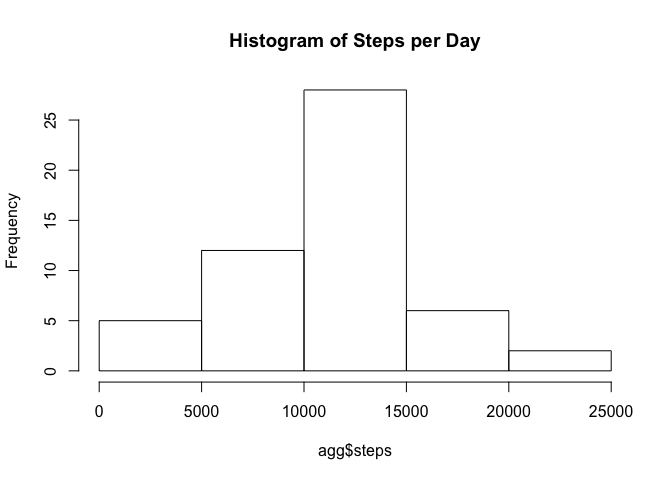
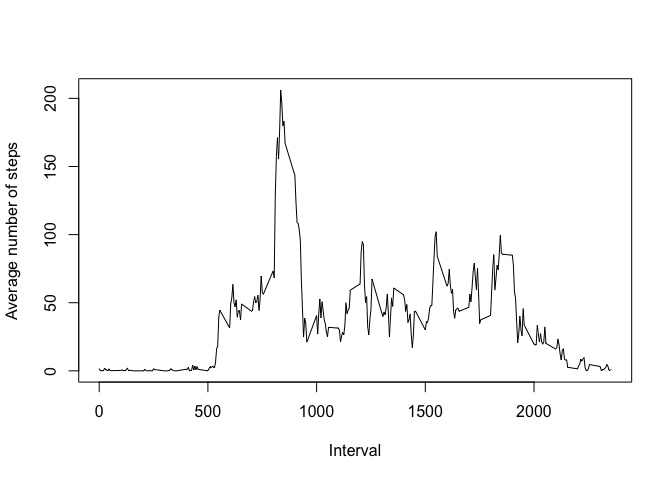
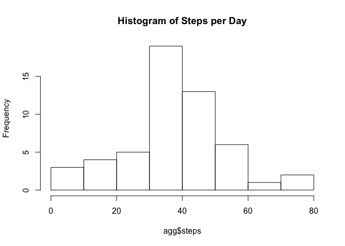
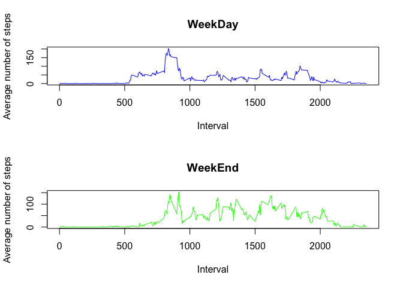

# Reproducible Research: Peer Assessment 1


```r
require(plyr)
```

```
## Loading required package: plyr
```

```r
require(dplyr)
```

```
## Loading required package: dplyr
## 
## Attaching package: 'dplyr'
## 
## The following objects are masked from 'package:plyr':
## 
##     arrange, count, desc, failwith, id, mutate, rename, summarise,
##     summarize
## 
## The following object is masked from 'package:stats':
## 
##     filter
## 
## The following objects are masked from 'package:base':
## 
##     intersect, setdiff, setequal, union
```

## Loading and preprocessing the data

```r
activity <- read.csv("activity.csv")
```


## What is mean total number of steps taken per day?


```r
agg <- aggregate(steps~date,data=activity,sum)
# *histogram of the total number of steps taken each day
hist(agg$steps,plot=TRUE, main="Histogram of Steps per Day")
```

 

```r
# *mean and median of the total number of steps taken per day
mean(agg$steps) #10766.19
```

```
## [1] 10766.19
```

```r
# median
median(agg$steps) #10765
```

```
## [1] 10765
```


## What is the average daily activity pattern?


```r
agg <- aggregate(steps~interval,data=activity,mean)
    # *Time series plot (i.e. type = "l") of the 5-minute interval (x-axis) and the average number of steps taken, averaged across all days (y-axis)
plot(agg$interval, agg$steps, type = "l", xlab = "Interval", ylab = "Average number of steps")
```

 

```r
    # *5-minute interval, on average across all the days in the dataset, that contains the maximum number of steps?
agg[agg$steps==max(agg$steps),]$interval #835
```

```
## [1] 835
```


## Imputing missing values


```r
sum(is.na(activity$steps)) #2304
```

```
## [1] 2304
```

```r
activity2 <- activity
activity2[is.na(activity2)] <- 0
agg <- aggregate(steps~date,data=activity,mean)
hist(agg$steps,plot=TRUE, main="Histogram of Steps per Day")
```

 

```r
mean(agg$steps) #37.3826
```

```
## [1] 37.3826
```

```r
median(agg$steps) #37.37847
```

```
## [1] 37.37847
```


## Are there differences in activity patterns between weekdays and weekends?

```r
activity2 <- mutate(activity2,wdays=weekdays(as.Date(date),abbreviate=T))
activity2 <- mutate(activity2,weekday=wdays %in% c("Mon","Tue","Wed","Thu","Fri")) #find weekdays
activity2 <- mutate(activity2,weekend=wdays %in% c("Sun","Sat"))
weekDayActivity <- activity2[activity2$weekday==TRUE,]
weekendActivity <- activity2[activity2$weekend==TRUE,]
aggWeekDay <- aggregate(steps~interval,data=weekDayActivity,mean)
aggWeekend <- aggregate(steps~interval,data=weekendActivity,mean)

par(mfrow=c(2,1))
plot(aggWeekDay$interval, aggWeekDay$steps, type = "l", xlab = "Interval", ylab = "Average number of steps",col="blue",main="WeekDay")
plot(aggWeekend$interval, aggWeekend$steps, type = "l", xlab = "Interval", ylab = "Average number of steps", col="green",main="WeekEnd")
```

 

